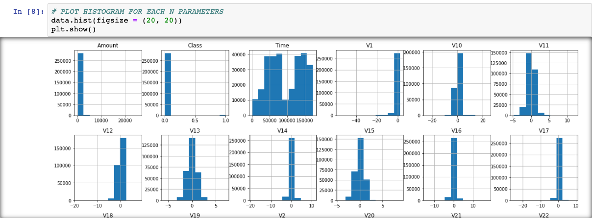
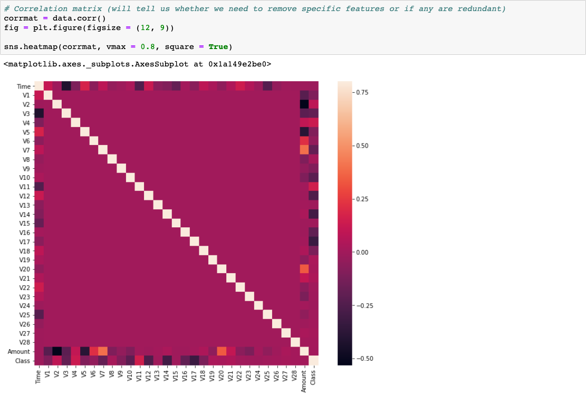
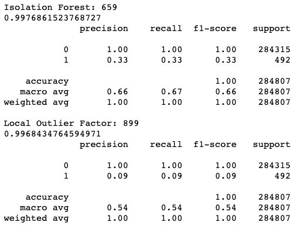

# CreditCardFraudDetector
Python script that uses Kaggle's credit card transaction dataset to detect future fraudulent credit card transactions.

# Technology
Built using SKLearn's IsolationForest implementation and SKLearn's LocalOutlierFactor implementation for anomaly detection in large datasets. 

# Process # 

# Results # 

